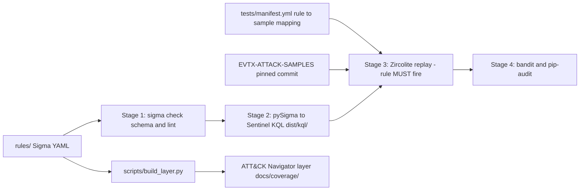

# detection-factory

Detection-as-Code pipeline: Sigma rules, validated in CI against real attack logs,
converted to Microsoft Sentinel KQL, mapped to MITRE ATT&CK.

## Why

Anyone can write a detection rule. The hard question is: **how do you know it fires?**
This repo answers it with engineering discipline: every rule is (1) schema-validated,
(2) converted to the target backend, (3) replayed against a real EVTX attack sample
and required to trigger, (4) security-scanned - all in CI, on every commit.

## Architecture



## Coverage

9 rules across 7 ATT&CK tactics. Load `docs/coverage/layer.json` in the
[ATT&CK Navigator](https://mitre-attack.github.io/attack-navigator/) to see it.

| Rule | Technique | Tactic |
|---|---|---|
| LSASS memory dump via comsvcs MiniDump | T1003.001 | Credential Access |
| PowerShell engine loaded by unusual host | T1059.001 | Execution |
| Scheduled task created via schtasks | T1053.005 | Persistence / Execution |
| Registry Run key modification | T1547.001 | Persistence |
| UAC bypass via eventvwr mscfile hijack | T1548.002 | Privilege Escalation |
| Rundll32 proxy execution | T1218.011 | Defense Evasion |
| Netsh port proxy persistence | T1090 | Command & Control |
| Security event log cleared (1102) | T1070.001 | Defense Evasion |
| Shell spawned by WmiPrvSE | T1047 | Execution / Lateral Movement |

## Test data - honest note

v1 rules are validated against community reference EVTX from
[sbousseaden/EVTX-ATTACK-SAMPLES](https://github.com/sbousseaden/EVTX-ATTACK-SAMPLES),
pinned to commit `4ceed2f` and downloaded at test time (never redistributed here).
v2 will regenerate these logs by executing the matching
[Atomic Red Team](https://github.com/redcanaryco/atomic-red-team) tests in a home lab.
No real client or employer data exists anywhere in this repository.

## Quickstart

```bash
python3 -m venv .venv && source .venv/bin/activate
pip install -r requirements.txt
bash scripts/setup_zircolite.sh
python3 tests/runner/fetch_samples.py
python3 tests/runner/run_tests.py      # every rule must fire
python3 scripts/convert_rules.py       # KQL output in dist/kql/
python3 scripts/build_layer.py         # ATT&CK Navigator layer
```

## Repository layout

```
rules/          Sigma rules, one directory per ATT&CK tactic
config/         validation config + Sentinel field-mapping pipelines
tests/          manifest (rule -> sample -> expected hits) + Zircolite runner
scripts/        KQL conversion + ATT&CK layer generation
docs/           coverage layer, design decisions, plans
.github/        CI pipeline
```

## Design decisions and trade-offs

See [docs/decisions.md](docs/decisions.md).
